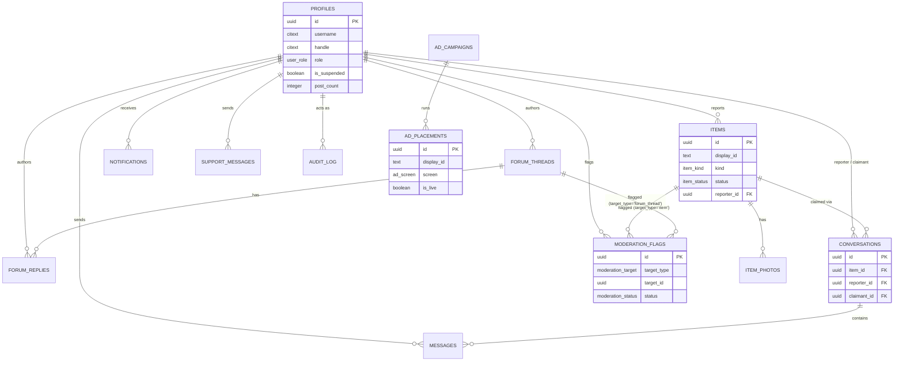

# Architecture

## Repo layout

```
/                     -- frontend: the Expo/React Native app (unchanged root,
                         so Expo/EAS/CI tooling keeps working as-is)
  app/                  Expo Router entry
  src/                  screens, sheets, state, theme, ui
  assets/, prototype/   images, the source-of-truth HTML prototype
  tools/oracle/         parity test harness against the prototype
  docs/PARITY.md        frontend<->prototype parity notes

backend/              -- Supabase: schema, RLS, storage, seed data
  supabase/migrations/
  supabase/seed.sql

design/               -- this folder: cross-cutting product/architecture docs
```

Frontend, backend and design are siblings. The frontend keeps its existing
root-level Expo config (`app.json`, `eas.json`, `package.json`, ...)
untouched — nothing in `tools/oracle/` or CI needed to change.

## Data model (ERD)



Full column definitions, constraints and RLS live in `backend/supabase/migrations/`.

## Roles across every screen

Two backend roles (`user`, `superadmin`); the frontend's third persona,
`newuser`, is a **derived** UI state (`role = 'user'` with no posts and no
guidelines acceptance yet), not a separate stored role.

| Screen / sheet | User | Superadmin |
|---|---|---|
| Welcome, Login, Signup, Forgot password | ✅ (public) | ✅ (public) |
| Dashboard | ✅ own stats, setup checklist | ✅ system-wide metrics |
| Lost / Found registry | ✅ browse, search, filter | ✅ browse (no report FAB) |
| Report an item (sheet) | ✅ | ❌ not exposed |
| Item detail (sheet) | ✅ claim / withdraw / mark handed over on own items | ✅ flag / delete any item |
| Chat (sheet) | ✅ with the other party on a claim | — (own claims only, same as user) |
| Forum | ✅ browse, post threads/replies | ✅ browse (no compose), suspend/delete any thread |
| Moderation | ❌ | ✅ approve/remove flagged items & threads |
| Analysis | ❌ | ✅ weekly report chart, flagged keywords, signals |
| Members | ❌ | ✅ suspend/remove any member |
| Ad placements + editor (sheet) | ❌ | ✅ toggle live, edit campaign/duration |
| Messages | ✅ own inbox | not currently exposed in the admin nav (backend supports it — `conversations`/`messages` RLS is participant-based, so wiring it up later is just adding the nav entry) |
| Support chat (sheet) | ✅ | ✅ |
| Profile / Guidelines (sheet) | ✅ | ✅ |

This mirrors `buildVals()`/`roleState()` in `src/state/selectors.ts` and
`src/state/store.ts` — the `is*` flags (`isModeration`, `isAds`,
`canPost`, `showFab`, ...) gating each screen and action there map directly
to the RLS policies described in `backend/README.md`.
